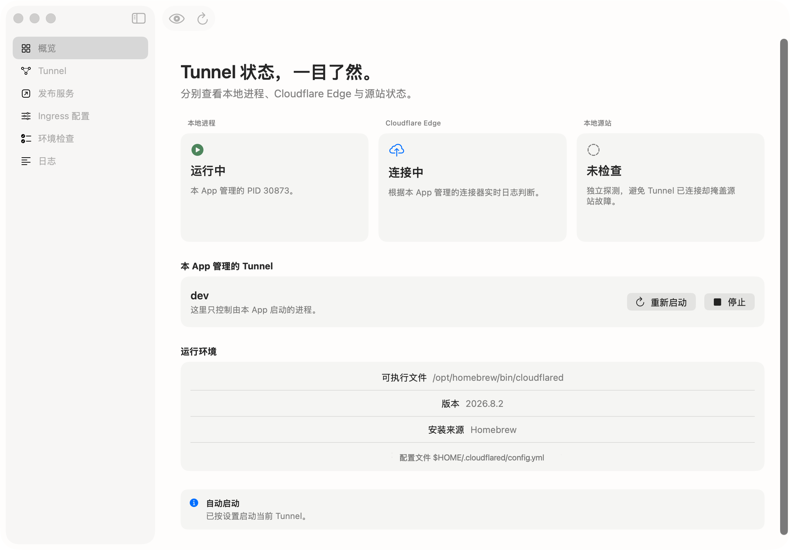

<p align="center">
  
</p>

<h1 align="center">Tunnelful</h1>

<p align="center">
  <strong>把 Cloudflare Tunnel 的本地运维变成清晰、可检查的 macOS 工作流。</strong><br />
  环境诊断、Ingress 配置、DNS 路由与运行状态，由一个原生菜单栏应用集中呈现。
</p>

<p align="center">
  <a href="https://github.com/ihopefulChina/Tunnelful/releases"></a>
  <a href="https://github.com/ihopefulChina/Tunnelful/actions/workflows/ci.yml"></a>
  <a href="app/Package.swift"></a>
  <a href="LICENSE"></a>
</p>

<p align="center">
  <a href="https://ihopefulchina.github.io/Tunnelful/">中文官网</a>
  · <a href="https://github.com/ihopefulChina/Tunnelful/releases">下载</a>
  · <a href="https://ihopefulchina.github.io/post/tunnelful-macos-control-plane/">设计文章</a>
  · <a href="#核心能力">核心能力</a>
  · <a href="#快速开始">快速开始</a>
  · <a href="#安全边界">安全边界</a>
  · <a href="#从源码开发">开发</a>
</p>

---

<p align="center">
  <picture>
    <source media="(prefers-color-scheme: dark)" srcset="website/public/tunnelful-window-dark-v0.1.2.png" />
    <source media="(prefers-color-scheme: light)" srcset="website/public/tunnelful-window-v0.1.2.png" />
    
  </picture>
</p>

<p align="center"><sub>主窗口概览 · 截图使用示例数据</sub></p>

> [!IMPORTANT]
> 当前源码版本为 `0.1.6`，可下载版本及其支持架构以 [GitHub Releases](https://github.com/ihopefulChina/Tunnelful/releases) 中的实际附件为准。目前公开安装包采用 ad-hoc 签名，尚未使用 Developer ID 签名或经过 Apple 公证。

## 核心能力

`cloudflared` 已经可靠地完成 Tunnel 协议与网络连接，Tunnelful 不重复实现这些能力。它补上的是日常使用中的 macOS 体验：把容易分散在终端、YAML 和进程日志里的操作集中起来，并在写入配置或启动服务前给出明确反馈。

- **首次设置**：检查 Homebrew、`cloudflared`、本地配置、Tunnel 凭据与账户状态，并提供安装和官方登录引导。
- **配置管理**：导入现有 `config.yml` 或 `config.yaml`，结构化编辑 `hostname`、`path` 与 `service`，保留其他配置段、注释和规则内高级字段。
- **安全写入**：先做本地结构检查，再调用官方 CLI 校验；通过后备份原文件并原子写入。文件被其他应用改动时会停止覆盖。
- **服务发布**：检查 HTTP/HTTPS 源站，更新本地 Ingress，并在明确确认后通过官方 CLI 配置 DNS 路由。
- **运行状态**：启动、停止和重启由 Tunnelful 创建的进程，分别展示本地进程、Cloudflare Edge 与源站状态。
- **原生日常体验**：窗口打开时提供完整 macOS 系统菜单；关闭全部窗口后隐藏 Dock 图标并继续常驻菜单栏。同时支持系统/浅色/深色外观、登录 Mac 时打开、应用启动后运行当前 Tunnel，以及应用内检查并安装更新。

## 适用范围

| 项目 | 当前支持 |
| --- | --- |
| 当前源码 | `0.1.6`；已发布版本见 [Releases](https://github.com/ihopefulChina/Tunnelful/releases) |
| macOS | macOS 14 或更高版本 |
| `0.1.6` 构建目标 | Apple 芯片 `arm64` 与 Intel `x86_64` 单架构 DMG |
| Tunnel 引擎 | 用户自行安装的官方 `cloudflared` |
| 主要工作流 | 已有本地配置的 locally-managed 命名 Tunnel |
| 分发状态 | ad-hoc 签名，尚无 Developer ID 签名与 Apple 公证 |

Tunnelful 是官方 `cloudflared` 的本地控制面，不是 Tunnel、VPN、Access 或 WARP 协议的另一套实现。应用不捆绑 `cloudflared`，也不会接管由终端、服务管理器或其他应用启动的进程。

## 快速开始

### 1. 下载 Tunnelful

前往 [GitHub Releases](https://github.com/ihopefulChina/Tunnelful/releases)，在目标版本下选择与 Mac 芯片对应的安装包：

| “关于本机”显示 | 安装包名称结尾 |
| --- | --- |
| “芯片：Apple …” | `-arm64.dmg` |
| “处理器：Intel …” | `-x86_64.dmg` |

若某个版本没有对应架构的附件，说明该版本不支持这台 Mac，请勿混用安装包。下载 DMG 及同名 `.sha256` 文件后，在同一目录校验完整性；将示例中的 `<version>` 与 `<arch>` 替换为实际文件名中的值：

```bash
shasum -a 256 -c 'Tunnelful-<version>-<arch>.dmg.sha256'
```

打开 DMG，将 `Tunnelful.app` 拖入“应用程序”。当前版本尚未经过 Apple 公证，首次启动可在访达中按住 Control 点按应用并选择“打开”；若仍被阻止，请前往“系统设置 → 隐私与安全性”确认。不要使用来源不明的命令绕过 macOS 安全检查。

### 2. 准备 cloudflared

打开 Tunnelful 的“环境检查”。应用会自动查找 Homebrew、官方安装包或 `PATH` 中的 `cloudflared`，也允许手动选择可信的可执行文件。

使用 Homebrew 安装：

```bash
brew install cloudflared
cloudflared --version
```

也可以按照 [Cloudflare 官方指南](https://developers.cloudflare.com/tunnel/advanced/local-management/create-local-tunnel/) 下载安装。`cloudflared` 的安装和升级由用户负责，Tunnelful 不会静默替换它。

### 3. 登录并准备命名 Tunnel

在“环境检查”中选择“开始官方登录…”。Tunnelful 会运行：

```bash
cloudflared tunnel login
```

登录在 Cloudflare 官方网页完成；Tunnelful 不接收 Cloudflare 密码、Token 或证书内容。

当前版本暂不在 GUI 中创建 Tunnel。若账户中还没有命名 Tunnel，请在终端创建一个中性的示例 Tunnel：

```bash
cloudflared tunnel create demo
```

记录命令输出的 Tunnel ID 与 credentials 文件位置，然后准备一个本地配置。下面的值均为占位示例，使用前必须替换：

```yaml
tunnel: <TUNNEL_ID>
credentials-file: <CREDENTIALS_FILE>

ingress:
  - hostname: preview.example.com
    service: http://127.0.0.1:3000
  - service: http_status:404
```

将文件保存为 `config.yml` 或 `config.yaml`，再通过“环境检查”或“Ingress 配置”导入。导入本身只读取文件，确认保存后才会写入。

### 4. 发布一个本地服务

假设本地服务正在监听 `http://127.0.0.1:3000`：

| 输入项 | 示例值 |
| --- | --- |
| Tunnel | `demo` |
| 域名 | `preview.example.com` |
| 本地源站 | `http://127.0.0.1:3000` |
| 路径 | 留空，或填写 `^/api/.*` |

在“发布服务”中检查源站并保存本地配置。Tunnelful 会先校验预览文件，再备份和更新原配置，同时生成下面的 DNS 命令：

```bash
cloudflared tunnel route dns --overwrite-dns=false demo preview.example.com
```

Tunnelful 会先显示待执行命令。你可以只复制它；若要直接执行，请核对真实 Tunnel 与域名，再点击“配置 DNS 路由…”并再次确认。应用会显式传入 `--overwrite-dns=false`，在 Cloudflare 账户中创建 CNAME 记录但不覆盖同名的已有 DNS 记录。若命令超时，远端结果可能已生效；请先在 Cloudflare DNS 核对记录再重试。随后可在应用中启动 Tunnel，并分别检查进程、Edge、源站与日志。

## GUI 与官方命令的对应关系

| Tunnelful 操作 | 官方命令或系统行为 | 当前行为 |
| --- | --- | --- |
| 检测可执行文件 | `cloudflared --version` | 自动执行，只接受可运行且能识别版本的文件 |
| 官方账户登录 | `cloudflared tunnel login` | 确认后执行，浏览器流程可取消 |
| 刷新 Tunnel 列表 | `cloudflared tunnel list --output json` | 自动执行并解析列表 |
| 保存 Ingress | `cloudflared tunnel --config <CONFIG_PATH> ingress validate` | 先校验临时预览，通过后再备份并保存 |
| 配置 DNS 路由 | `cloudflared tunnel route dns --overwrite-dns=false <TUNNEL> <HOSTNAME>` | 显示真实命令并可复制；核对目标并再次确认后才执行 |
| 启动 Tunnel | `cloudflared tunnel --config <CONFIG_PATH> run <TUNNEL>` | 作为 Tunnelful 子进程启动并读取日志 |
| 停止或重启 | 向本应用创建的进程发送终止信号 | 不影响其他 `cloudflared` 进程 |

## macOS 使用方式

- 关闭主窗口不会退出应用；Tunnelful 继续留在菜单栏。
- 打开任一应用窗口时，Tunnelful 成为标准当前应用，并在屏幕顶部显示“Tunnelful、文件、编辑、显示、窗口、帮助”系统菜单。
- 关闭全部 Tunnelful 窗口后，Dock 图标自动隐藏，菜单栏入口和已启动的 Tunnel 继续保留。
- “关于 Tunnelful”“设置…”与帮助入口位于屏幕顶部的 macOS 系统菜单，不占用主窗口工具栏。
- 菜单栏可打开主窗口、启动/停止/重启当前 Tunnel、查看日志、检查环境和检查更新。
- “登录 Mac 时自动打开 Tunnelful”与“打开 Tunnelful 后自动启动当前 Tunnel”可以分别启用；自动启动只会在 `cloudflared` 与可运行 Tunnel 等条件完整时发生。
- 登录项需要从“应用程序”文件夹中的 Tunnelful 注册。若仍从安装盘或 macOS 临时副本运行，需退出后从“应用程序”重新打开。macOS 也可能要求在系统设置中确认。
- 软件更新通过 Sparkle 检查官方更新源。发现新版本后由你确认安装；安装完成后应用会重新打开。
- 外观支持跟随系统、浅色和深色，选择会应用到主窗口、设置与菜单栏界面。

## 安全边界

- 不内置遥测、广告或分析 SDK。
- 命令通过 `Process` 参数数组执行，不经过 shell 字符串拼接。
- 启动 `cloudflared` 时会移除可能暗中改变账户、Token 或 DNS 覆盖行为的 Cloudflare 环境变量；DNS 命令还会显式关闭覆盖。
- 不读取、展示或上传 Tunnel credentials 与 `cert.pem` 的内容，只检查必要的文件元数据和账户可用性。
- 配置覆盖前会备份并保留原文件权限；临时预览文件只允许当前用户读写。
- 日志会尽力遮罩常见令牌和用户目录；界面不再提供截图隐私模式。
- 源站检查会向输入的 HTTP/HTTPS 地址发送一次短时 GET 请求，不应使用具有副作用的地址进行检查。

日志脱敏是防误操作保护，不是完整的数据防泄漏系统。分享配置、命令、日志或截图前仍需人工检查。更多边界与漏洞报告方式见 [安全政策](SECURITY.md)。

## 当前未实现

- 在 GUI 中创建或删除命名 Tunnel。
- 批量配置 DNS 路由，或自动覆盖同名的已有 DNS 记录。
- Quick Tunnel。
- remotely-managed Tunnel Token 与钥匙串工作流。
- Cloudflare API、远程配置、Access 策略、私网路由与多主机副本管理。
- `cloudflared` 自动安装或自动更新。
- Developer ID 签名、Apple 公证与后台静默安装更新。

## 文档与支持

- [快速开始](#快速开始)：完成安装、官方登录、配置导入与首个服务发布。
- [更新日志](CHANGELOG.md)：查看已发布版本与尚未发布的用户可见变化。
- [贡献指南](CONTRIBUTING.md)：了解开发环境、实现约束与验证要求。
- [安全政策](SECURITY.md)：确认支持范围并私下报告安全问题。
- [发布流程](docs/RELEASE.md)：维护者构建、校验和发布安装包的完整门槛。
- [设计文章](https://ihopefulchina.github.io/post/tunnelful-macos-control-plane/)：从控制面边界、配置写入协议与状态拆分理解 Tunnelful。
- [第三方声明](THIRD_PARTY_NOTICES.md)：查看依赖、素材与商标说明。
- [GitHub Issues](https://github.com/ihopefulChina/Tunnelful/issues)：提交可复现的问题或聚焦的功能建议。

## 从源码开发

要求：macOS 14 或更高版本、支持 Swift 5.10 的 Xcode。原生应用当前没有额外的第三方 Swift Package 依赖。

```bash
git clone https://github.com/ihopefulChina/Tunnelful.git
cd Tunnelful
open app/TunnelApp.xcodeproj
```

运行不依赖真实 Cloudflare 账户的单元测试：

```bash
swift test --package-path app
```

验证公开内容与官网：

```bash
bash scripts/check-public-content.sh
npm ci --prefix website
npm run --prefix website lint
npm run --prefix website build:pages
```

仓库结构：

```text
Tunnelful/
├── app/TunnelApp/          # SwiftUI 应用与核心逻辑
├── app/TunnelAppTests/     # 不依赖真实账户的单元测试
├── website/                # 中文官网
├── scripts/                # 发布与公开内容检查
└── docs/RELEASE.md         # 维护者发布流程
```

静态检查、单元测试或构建通过，不等于真实 Cloudflare 账号联调、Intel 实机、签名、公证或生产可用性验证通过。

## 构建发布包

在 macOS 上生成两个单架构 DMG 与对应 SHA-256 文件：

```bash
bash scripts/build-release.sh
bash scripts/verify-release.sh release/Tunnelful-0.1.6-arm64.dmg release/appcast.xml
bash scripts/verify-release.sh release/Tunnelful-0.1.6-x86_64.dmg release/appcast.xml
```

发布脚本会分别构建 `arm64` 与 `x86_64` 应用，移除调试符号、应用 ad-hoc 签名并验证 DMG；它不会访问 Developer ID 证书，也不会执行 Apple 公证或上传产物。

推送与 `VERSION` 一致的 `v*` 标签后，GitHub Actions 会重新测试、构建、验证并创建 Release。完整门槛、附件清单和 GitHub Pages 流程见 [发布流程](docs/RELEASE.md)。

## 参与贡献

欢迎从可复现、范围明确的问题开始。提交代码前请阅读 [贡献指南](CONTRIBUTING.md)，并避免在 Issue、测试、截图或示例中加入真实域名、账号标识、凭据、令牌或个人绝对路径。安全问题请按 [安全政策](SECURITY.md) 私下报告。

## 许可与商标

Tunnelful 以 [Apache License 2.0](LICENSE) 发布。

Tunnelful 是独立开源项目，与 Cloudflare, Inc. 不存在隶属、合作、赞助或背书关系。Cloudflare、Cloudflare Tunnel 与 `cloudflared` 等名称和标识归其各自权利人所有。
